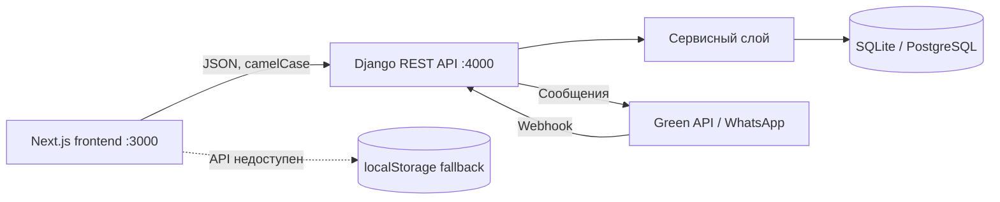

# QORJYN

QORJYN — B2B-система управления запасами и совместными закупками для малого бизнеса. Проект объединяет складской учет, прогнозирование дефицита, тендеры поставщиков, закупочные волны, соседский резерв и WhatsApp-бота.

## Возможности

- складские остатки по товарам и торговым точкам;
- ручной и имитированный AI-ввод по фото или голосу;
- dashboard с рисками, KPI и историей активности;
- обратный тендер среди поставщиков;
- коллективные закупочные волны;
- передача излишков соседнему бизнесу;
- заказы, статусы доставки и рейтинг поставщиков;
- onboarding бизнеса и рекомендации порогов;
- интеграция с Green API для WhatsApp;
- автономный режим frontend на `localStorage`, если API недоступен.

## Технологии

| Слой | Стек |
|---|---|
| Frontend | Next.js 14, React 18, TypeScript, Tailwind CSS, Recharts |
| Backend | Django 5.2, Django REST Framework |
| Данные | SQLite локально, PostgreSQL через `DATABASE_URL` |
| Интеграции | Green API / WhatsApp |
| Тестирование | pytest, pytest-django, production build Next.js |

## Архитектура



Подробности: [архитектура](docs/ARCHITECTURE.md) и [контракт API](docs/API.md).

## Быстрый запуск

Требуются Python 3.11+ и Node.js 20+.

### Backend

```powershell
cd backend
python -m venv .venv
.\.venv\Scripts\python.exe -m pip install -r requirements.txt
Copy-Item .env.example .env
.\.venv\Scripts\python.exe manage.py migrate
.\.venv\Scripts\python.exe manage.py seed_demo
.\.venv\Scripts\python.exe manage.py runserver 4000
```

### Frontend

В отдельном терминале:

```powershell
cd frontend
npm ci
Copy-Item .env.local.example .env.local
npm run dev
```

Откройте:

- приложение: <http://localhost:3000>;
- API health check: <http://localhost:4000/api/health>;
- Django Admin: <http://localhost:4000/admin/>;
- аналитика Admin: <http://localhost:4000/admin/analytics/>.

## Проверки

```powershell
cd backend
.\.venv\Scripts\python.exe manage.py check
.\.venv\Scripts\python.exe -m pytest -q

cd ..\frontend
npm run build
```

Текущий проверенный результат: 139 backend-тестов и успешная production-сборка frontend.

## Demo-данные

Команда ниже возвращает справочники и операции в исходное демонстрационное состояние:

```powershell
cd backend
.\.venv\Scripts\python.exe manage.py seed_demo
```

То же действие доступно через `POST /api/reset`. Оно предназначено только для demo-среды.

## Документация

- [API](docs/API.md) — маршруты, параметры и примеры запросов;
- [Архитектура](docs/ARCHITECTURE.md) — модули, потоки данных и инварианты;
- [Разработка и запуск](docs/DEVELOPMENT.md) — окружение, тесты, WhatsApp и troubleshooting;
- [Backend README](backend/README.md) — краткая памятка по Django.

## Структура репозитория

```text
Qorjyn/
├── frontend/              # Next.js-приложение
├── backend/               # Django API, сервисы, модели и тесты
├── docs/                  # Техническая документация
├── QORJYN.md              # Продуктовый план
└── README.md
```

## Безопасность перед развертыванием

- замените `DJANGO_SECRET_KEY`;
- установите `DJANGO_DEBUG=false`;
- ограничьте `ALLOWED_HOSTS` и CORS доверенными доменами;
- храните Green API credentials только в переменных окружения;
- не используйте `/api/reset` в публичной production-среде без защиты;
- настройте PostgreSQL через `DATABASE_URL`.
