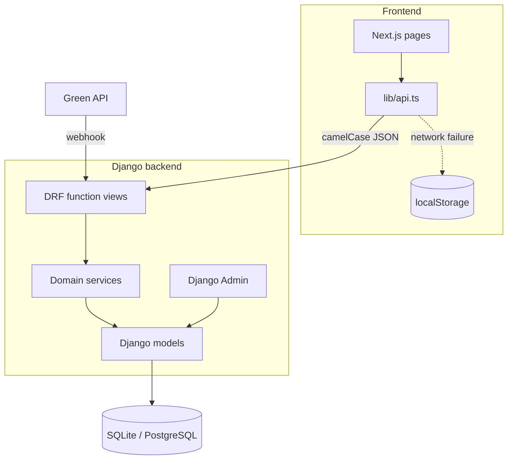
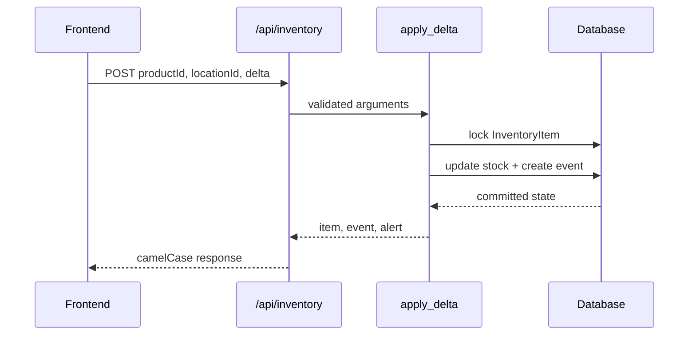

# Архитектура QORJYN

## Общая схема

QORJYN разделен на независимый Next.js frontend и Django REST backend. Frontend обращается к API напрямую по `NEXT_PUBLIC_API_URL`. Backend хранит данные через Django ORM и предоставляет единый сервисный слой для HTTP API и WhatsApp-бота.

## Backend-модули

| Модуль | Ответственность |
|---|---|
| `businesses` | бизнесы, торговые точки, onboarding и рекомендации |
| `catalog` | товары, категории, поставщики, цены и каталог инструментов |
| `supply` | остатки, события, прогнозы, заказы, волны, rescue и KPI |
| `bot` | Green API, нормализация телефонов и диалог WhatsApp |
| `config` | settings, URL, ID, exception envelope и health check |

Views остаются тонкими: проверяют HTTP-вход, вызывают сервисы и формируют envelope. Бизнес-правила и записи размещены в `services/`.

## Ключевые потоки

### Изменение остатка

`apply_delta` — единственная точка складского изменения. Она блокирует строку, запрещает отрицательный остаток, пересчитывает статус и пишет `InventoryEvent`.

### Rescue transfer

Принятие соседского резерва блокирует transfer, списывает товар у отправителя, приходует у получателя и завершает transfer. Вся операция атомарна: частичная передача невозможна.

### Заказ и надежность

Создание заказа рассчитывает позиции по актуальным ценам поставщика. Переход в `delivered` создает складской приход и обновляет рейтинг поставщика. Счетчики поставщика меняются под блокировкой строки.

### WhatsApp

Webhook немедленно подтверждает получение, дедуплицирует сообщения по `idMessage` и передает обработку диалоговому сервису. В demo/test режиме отправка сообщений логируется вместо сетевого вызова.

## API-контракт

- модели и база используют `snake_case`;
- renderer DRF преобразует ответы в `camelCase`;
- входные payload читаются в `camelCase`;
- query-параметры явно читаются как `businessId`, `locationId` и т. п.;
- все ответы имеют поле `success`;
- ошибки проходят через общий exception handler.

Ключи словарей, например ID товаров внутри `basePrice`, не преобразуются.

## Транзакции и конкурентный доступ

Транзакции используются для всех составных записей:

- складские изменения;
- создание и доставка заказов;
- join/leave закупочной волны;
- accept/decline rescue transfer;
- onboarding бизнеса с несколькими точками;
- пересчет надежности поставщика;
- восстановление demo-данных.

`select_for_update()` применяется внутри `transaction.atomic`, поэтому поведение одинаково корректно на PostgreSQL и SQLite-тестах.

## Идентификаторы

Публичные доменные сущности используют строковые ID длиной до 40 символов. Генератор сочетает префикс, миллисекунды и случайный суффикс, что сохраняет читаемость и предотвращает коллизии при создании нескольких сущностей в одном цикле.

## Offline fallback

Frontend переключается на `localStorage` только при сетевой ошибке. HTTP 4xx/5xx от доступного backend не считаются offline-состоянием и не должны приводить к локальной записи — это предотвращает расхождение интерфейса и базы.

Read-сценарии получают demo-данные из локального состояния. Основные mutation-сценарии имеют эквивалентную локальную реализацию для демонстрации без сети.

## Данные и окружения

- SQLite используется по умолчанию для локальной разработки.
- Любой PostgreSQL URL можно передать через `DATABASE_URL`.
- Demo-данные хранятся в fixture и загружаются командой `seed_demo`.
- Временные даты fixture сдвигаются целыми неделями, сохраняя дни недели для сезонного прогноза.
